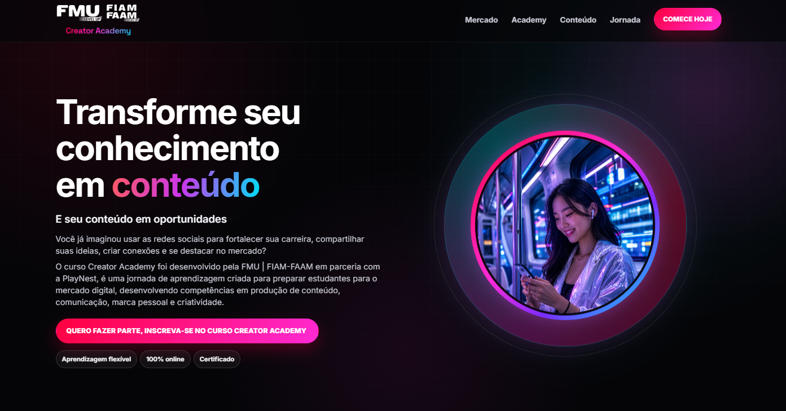

# Creator Academy | FMU + PlayNest

Landing page institucional criada para apresentar o **Creator Academy**, curso realizado por meio de uma parceria entre o **Centro Universitário FMU** e a **PlayNest**.

## Sobre o projeto

O Creator Academy é uma iniciativa voltada à formação e ao desenvolvimento de novos criadores. Esta landing page reúne as principais informações sobre o curso, seus conteúdos, diferenciais e formas de participação.

O projeto foi desenvolvido de maneira colaborativa, reunindo profissionais responsáveis pelo desenvolvimento da interface, estrutura técnica e demais etapas da solução.

## Funcionalidades

* Apresentação institucional do Creator Academy
* Informações sobre a parceria entre FMU e PlayNest
* Exposição dos conteúdos e diferenciais do curso
* Seções organizadas para facilitar a navegação
* Chamada para inscrição ou participação
* Interface adaptada para diferentes tamanhos de tela

## Preview



## Demonstração

Acesse a landing page:

[Visualizar o Creator Academy](https://fmu-content.s3.us-east-1.amazonaws.com/FMU/EAD/CREATOR_ACADEMY/LP-CreatorAcademy/index.html)

## Tecnologias utilizadas

### Front-end

* HTML5
* CSS3

### Desenvolvimento e publicação

* Git
* GitHub
* GitHub Pages

## Como executar localmente

Clone o repositório:

```bash
git clone https://github.com/jemacieldev/LP-INSTITUCIONAL.git
```

Entre na pasta do projeto:

```bash
cd LP-INSTITUCIONAL
```

Abra o arquivo `index.html` no navegador ou utilize a extensão **Live Server** no Visual Studio Code.

## Estrutura do projeto

```text
LP-INSTITUCIONAL/
├── assets/
│   └── preview.png
├── icons/
├── index.html
├── style.css
├── .gitignore
└── README.md
```

## Equipe do projeto

| Integrante              | Atuação                   |
| ----------------------- | ------------------------- |
| Jessica Maciel da Silva | Desenvolvimento Front-end |
| Kamis Hora              | Desenvolvimento Back-end  |

## Instituições parceiras

* Centro Universitário FMU
* PlayNest

## Créditos

Projeto desenvolvido colaborativamente para a apresentação institucional do **Creator Academy**.

As marcas, logotipos e demais elementos institucionais mencionados pertencem aos seus respectivos titulares.
